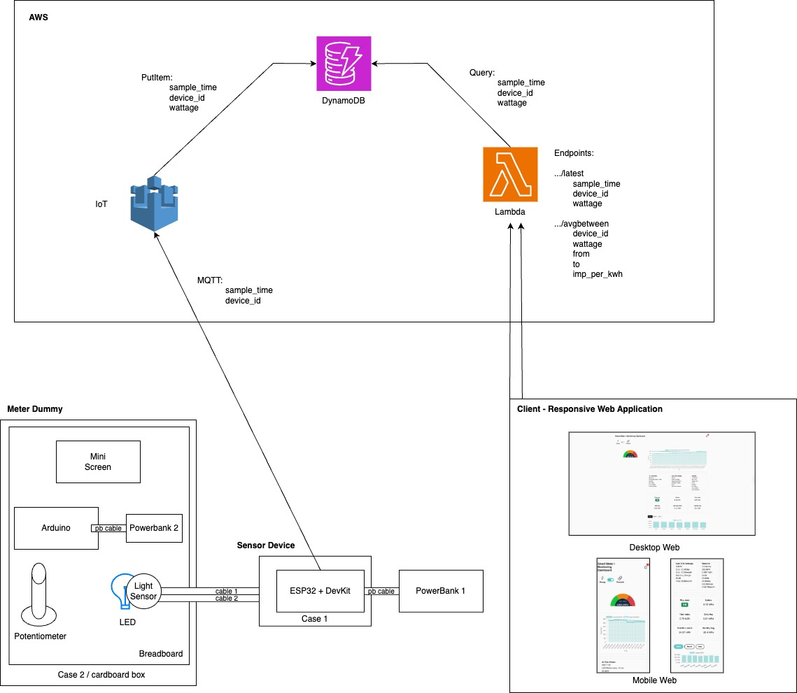

# Smart Meter | Monitoring Dashboard

A responsive web application for monitoring electricity usage and cost in real time.

🔗 **Web Access**: [https://smart-meter-ui.vercel.app/](https://smart-meter-ui.vercel.app/)

---

## About

The adoption of smart meters is accelerating globally. As of 2024, the global smart meter market is valued at approximately USD 26.7 billion and is projected to reach USD 50.3 billion by 2033, growing at a CAGR of 7.24%. This growth is driven by increasing demand for efficient energy management and supportive government policies promoting smart grid technologies[^1]. In Great Britain, 66% of all meters are now smart or advanced meters, with 60% operating in smart mode, reflecting significant progress in smart meter deployment[^2].

---

## System Overview and Architecture

This smart meter system is a full-stack, IoT-enabled electricity monitoring platform consisting of custom-built hardware, a serverless backend using AWS (including Lambda, DynamoDB, and IoT Core), and a responsive web-based dashboard built with Bootstrap 5, Chart.js, and JavaScript. It provides real-time insights into consumption and cost, with live graphs, financial toggles, notifications, and theme control. This system was developed for academic prototyping.



---

## Hardware

- **Meter Dummy**: A cardboard case with an LED + potentiometer simulating meter blinks.
- **Sensor**: Light sensor (LDR) connected to an ESP32 DevKit detects LED blinks as energy pulses.
- **Microcontrollers**: Arduino UNO controls LED; ESP32 timestamps and transmits pulse data.
- **Power**: Two power banks – one for the Arduino screen setup, one for the ESP32.

---

## Backend (AWS)

- **AWS IoT Core**: Receives MQTT messages from ESP32 containing `sample_time` and `device_id`.
- **DynamoDB**: Stores timestamped wattage readings for historical analysis.
- **AWS Lambda**: Serverless functions serve API endpoints:
  - `/latest/<device_id>` – Fetch most recent reading.
  - `/avgbetween/<device_id>/<from>/<to>/<imp_per_kwh>` – Compute average usage over time.

---

## Frontend

- **Technologies**: HTML5, Bootstrap 5, JavaScript (ES6), jQuery, Chart.js
- **Features**:
  - Live usage monitoring with dynamic graphs
  - Energy-to-cost conversion based on user tariff
  - Session and daily/monthly summaries
  - Dark mode with themed icons
  - Real-time toast notifications

---

## API Sample Usage

```http
GET /latest/0
GET /avgbetween/0/1744153130844/1744253130844/800
```

---

## Contributors – Group 4

- Kiranjeet Dhillon
- Pakkapol Lailert
- Rasyid Gatra Wijaya
- Sol Merritt
- Sujint Pongchababnapa
- Suthiwat Umpornpaiboon
- Yousuf Mohammed

---

## Course

Group 4 – Mobile and Pervasive Systems

---

## References

[^1]: IMARC Group. _Smart Meter Market: Global Industry Trends, Share, Size, Growth, Opportunity and Forecast 2024–2033_. Retrieved from [imarcgroup.com](https://www.imarcgroup.com/smart-meter-market)
[^2]: Department for Energy Security & Net Zero, UK Government. _Smart Meters in Great Britain, Quarterly Update: December 2023_. Retrieved from [gov.uk](https://www.gov.uk/government/statistics)
